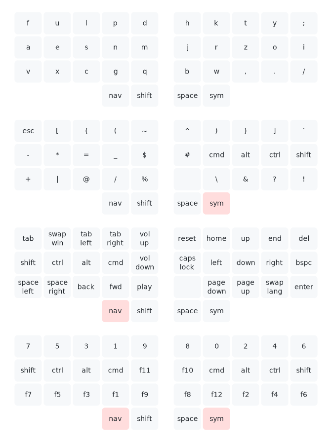

I forked callum-oakley repo as I find his script very clever to quickly generate
svg map from python script.

It is klawa layout. Polish optimized layout. 

It is just temp draft, who knows what I will use at the end. ;-)

